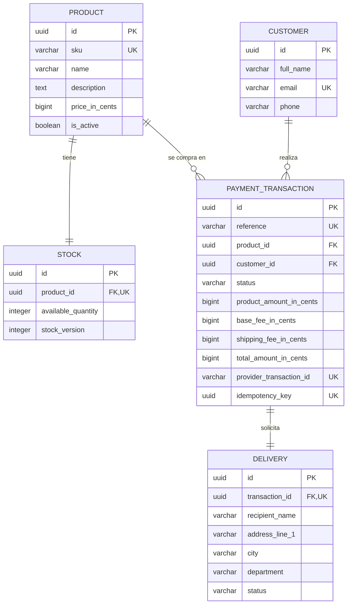

# Pasarela de Pago FullStack — Evaluación Técnica

Flujo de pago en una sola página (*single-page checkout*) enfocado en móviles (*mobile-first*) para un único producto: listado de productos → tarjeta de crédito e información de entrega → resumen del pago → resultado de la transacción, respaldado por una API REST con arquitectura hexagonal.

> Estado: 🚧 En progreso — construido de forma incremental, día a día. Consulta el historial de *commits* para ver el desarrollo completo.

## Tabla de contenidos
- [Pasarela de Pago FullStack — Evaluación Técnica](#pasarela-de-pago-fullstack--evaluación-técnica)
  - [Tabla de contenidos](#tabla-de-contenidos)
  - [Descripción general](#descripción-general)
  - [Stack tecnológico](#stack-tecnológico)
  - [Estructura del proyecto](#estructura-del-proyecto)
  - [Flujo de negocio](#flujo-de-negocio)
  - [Modelo de datos](#modelo-de-datos)
    - [Estados y reglas de integridad](#estados-y-reglas-de-integridad)
    - [Seguridad de pagos](#seguridad-de-pagos)
  - [Primeros pasos](#primeros-pasos)
  - [Variables de entorno](#variables-de-entorno)
    - [Base de datos local](#base-de-datos-local)
    - [Pasarela de pago de pruebas](#pasarela-de-pago-de-pruebas)
  - [Documentación de la API](#documentación-de-la-api)
  - [Pruebas (Testing)](#pruebas-testing)
  - [Despliegue en vivo](#despliegue-en-vivo)
  - [Decisiones de arquitectura](#decisiones-de-arquitectura)

## Descripción general

Este proyecto implementa el flujo de *onboarding* para un cliente que compra un solo producto: captura de datos de pago (tarjeta de crédito) y de entrega, procesamiento de la transacción a través de una pasarela de pago de terceros (modo *sandbox*), y actualización del *stock* del producto una vez que la transacción se resuelve.

## Stack tecnológico

| Capa | Elección |
|---|---|
| Frontend | React + Redux Toolkit (arquitectura Flux) |
| Backend | NestJS — Arquitectura Hexagonal (Puertos y Adaptadores) |
| Base de datos | PostgreSQL |
| Pruebas | Jest (meta: >80% de cobertura, front y back) |
| Despliegue | AWS |

## Estructura del proyecto

```
.
├── backend/     # API NestJS — src/domain, src/application, src/infrastructure
├── frontend/    # React SPA — store de Redux Toolkit, UI mobile-first
└── README.md
```

El backend inicia con `npm install` y `npm run start:dev` desde `backend/`. Sus adaptadores HTTP viven en `src/infrastructure/http`, los casos de uso en `src/application` y el dominio permanece independiente del framework en `src/domain`.

## Flujo de negocio

Esta aplicación sigue un flujo de 5 pantallas:

```
1. Página del producto → 2. Tarjeta de crédito / Info de entrega → 3. Resumen → 4. Estado final → 5. Página del producto
```

## Modelo de datos

La persistencia usa PostgreSQL. Los valores monetarios se almacenan como enteros en centavos de COP para evitar errores de precisión y las fechas se guardan en UTC (`timestamptz`).



| Entidad | Propósito y campos principales |
|---|---|
| `products` | Catálogo sembrado. Incluye `sku` único, nombre, descripción, `price_in_cents`, moneda `COP`, estado activo y auditoría. No se expone un endpoint para crearlo. |
| `stock` | Relación 1:1 con el producto mediante `product_id` único. Tiene `available_quantity >= 0` y `stock_version` para control optimista de concurrencia. |
| `customers` | Comprador identificado por nombre, email único, teléfono y, si se requiere, tipo y número de documento. |
| `payment_transactions` | Registro del intento de pago: referencia única, producto, cliente, estado, importes congelados, identificador de la pasarela e `idempotency_key` único. |
| `deliveries` | Dirección y destinatario de la entrega. Tiene una relación 1:1 con la transacción mediante `transaction_id` único. |

### Estados y reglas de integridad

- Una transacción inicia en `PENDING` y puede terminar en `APPROVED`, `DECLINED`, `ERROR` o `VOIDED`.
- Una entrega inicia en `PENDING` y puede pasar a `READY_FOR_SHIPMENT`, `SHIPPED`, `DELIVERED` o `CANCELLED`.
- La transacción conserva `product_amount_in_cents`, `base_fee_in_cents`, `shipping_fee_in_cents` y `total_amount_in_cents`; así un cambio de precio posterior no altera el historial. La base de datos valida que el total sea la suma de sus componentes.
- Ante un pago aprobado, el estado de transacción y el descuento de una unidad de inventario se actualizan en una misma transacción de base de datos, bloqueando la fila de `stock` y verificando nuevamente que haya disponibilidad. Un pago rechazado o fallido no modifica inventario.
- `idempotency_key` evita crear o cobrar dos veces si el cliente reintenta la solicitud después de una recarga o una falla de red.

### Seguridad de pagos

La aplicación **no almacena** número completo de tarjeta (PAN), CVV ni fecha de vencimiento. El backend usa el token para procesar el pago con la pasarela y persiste solamente datos no sensibles que retorne esta, como `provider_transaction_id`, tipo de pago, marca y últimos cuatro dígitos enmascarados, cuando estén disponibles. Los datos de tarjeta tampoco deben escribirse en logs.

## Primeros pasos

1. Inicia PostgreSQL desde la raíz del repositorio:

   ```bash
   docker compose up -d database
   ```

2. Configura e inicializa el backend:

   ```bash
   cd backend
   cp .env.example .env
   npm install
   npm run database:setup
   npm run start:dev
   ```

`database:setup` ejecuta las migraciones pendientes y carga tres productos ficticios con sus existencias. El seed es idempotente: se puede repetir sin crear productos duplicados.

## Variables de entorno

El backend incluye [`.env.example`](backend/.env.example) como plantilla. Crea tu configuración local desde la carpeta `backend`:

```powershell
Copy-Item .env.example .env
```

`backend/.env` está ignorado por Git y nunca debe subirse. Tampoco se deben incluir claves reales en `.env.example`, código fuente, capturas de pantalla o logs.

### Base de datos local

Con el servicio `database` de Docker iniciado, conserva los valores incluidos en la plantilla:

| Variable | Valor local |
|---|---|
| `DB_HOST` | `localhost` |
| `DB_PORT` | `5432` |
| `DB_USERNAME` | `payment_user` |
| `DB_PASSWORD` | `payment_password` |
| `DB_NAME` | `payment_checkout` |

### Pasarela de pago de pruebas

Completa solo tu archivo local `backend/.env` con los datos del apartado **Herramientas de prueba (UAT)** del documento de la prueba. No copies los valores a este README ni a `.env.example`.

| Variable en `backend/.env` | Valor del documento que debes usar |
|---|---|
| `PAYMENT_GATEWAY_BASE_URL` | `UAT_SANDBOX_URL` |
| `PAYMENT_GATEWAY_PUBLIC_KEY` | Llave pública de sandbox, identificada con el prefijo `pub_stagtest_` |
| `PAYMENT_GATEWAY_PRIVATE_KEY` | Llave privada de sandbox, identificada con el prefijo `prv_stagtest_` |
| `PAYMENT_GATEWAY_INTEGRITY_SECRET` | Secreto de integridad de sandbox, identificado con el prefijo `stagtest_integrity_` |

No uses aquí la URL de UAT que no sea sandbox, las credenciales de acceso al portal ni la clave de eventos: no las requiere este adaptador. La clave de eventos se usará más adelante al implementar la validación de eventos o *webhooks*.

Tras guardar `.env`, reinicia el backend para cargar las variables. Puedes comprobar que Git lo ignora con:

```powershell
git check-ignore -v backend/.env
```

## Documentación de la API

Con el backend iniciado, la documentación interactiva de Swagger está disponible en [http://localhost:3000/api/docs](http://localhost:3000/api/docs). La especificación OpenAPI en JSON se publica en [http://localhost:3000/api/docs-json](http://localhost:3000/api/docs-json).

También puedes importar la [colección de Postman](docs/postman/payment-checkout.postman_collection.json) y su [plantilla de entorno](docs/postman/payment-checkout.local.postman_environment.json). Completa únicamente los valores locales en Postman; no guardes ni exportes credenciales de sandbox en la colección o en el entorno versionado.

Orden sugerido para probar el flujo: `List active products` → `Get acceptance data` → acepta explícitamente los contratos mostrados → `Tokenize card` → `Create transaction` → `Process payment`. La colección guarda automáticamente los identificadores y tokens temporales en el entorno activo.

## Pruebas (Testing)

### Tarjetas de prueba

Usa estos datos únicamente en el entorno sandbox. No ingreses ni compartas tarjetas reales, incluso en capturas de pantalla o colecciones de Postman.

| Uso | Franquicia | Número | Vencimiento | CVC | Resultado esperado |
|---|---|---|---|---|---|
| Flujo sandbox de aprobación | Visa | `4242 4242 4242 4242` | Cualquier fecha futura | Cualquier 3 dígitos | `APPROVED` |
| Flujo sandbox de rechazo | Visa | `4111 1111 1111 1111` | Cualquier fecha futura | Cualquier 3 dígitos | `DECLINED` |
| Validación visual local | Mastercard | `5555 5555 5555 4444` | Fecha futura, por ejemplo `12/30` | `123` | El formulario reconoce la franquicia y supera Luhn; no la envíes al sandbox. |

El proveedor solo publica las dos tarjetas Visa anteriores para su flujo sandbox directo; cualquier otra tarjeta puede finalizar en `ERROR`. La tarjeta Mastercard de la tabla sirve exclusivamente para comprobar la detección y validación local de la interfaz. Consulta los [datos de prueba oficiales de sandbox](https://docs.wompi.co/docs/colombia/datos-de-prueba-en-sandbox/) antes de realizar una prueba de pago.

_TODO — Aquí se documentará el informe de cobertura (backend y frontend)._

## Despliegue en vivo

_TODO — Los enlaces de AWS (API + frontend) se agregarán en la entrega final._

## Decisiones de arquitectura

- **Arquitectura Hexagonal (Puertos y Adaptadores):** la lógica de negocio reside fuera de la capa de rutas/controladores, aislada de las dependencias del *framework* y de la infraestructura.
- **Programación Orientada a Vías de Tren (Railway Oriented Programming - ROP):** los casos de uso (crear transacción → llamar a la pasarela de pago → manejar el resultado) se modelan como un flujo (*pipeline*) de éxito/fallo en lugar de bloques *try/catch* anidados.
- **Resiliencia:** el progreso del proceso de pago se persiste en el lado del cliente (Redux + localStorage) para que, si se recarga la página, no se pierda el avance del usuario.
